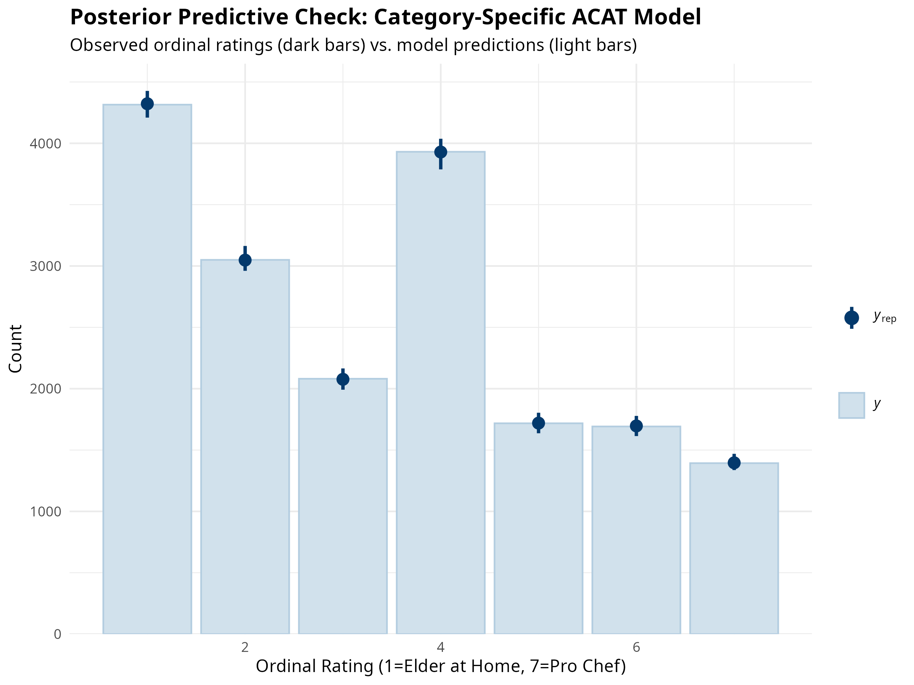
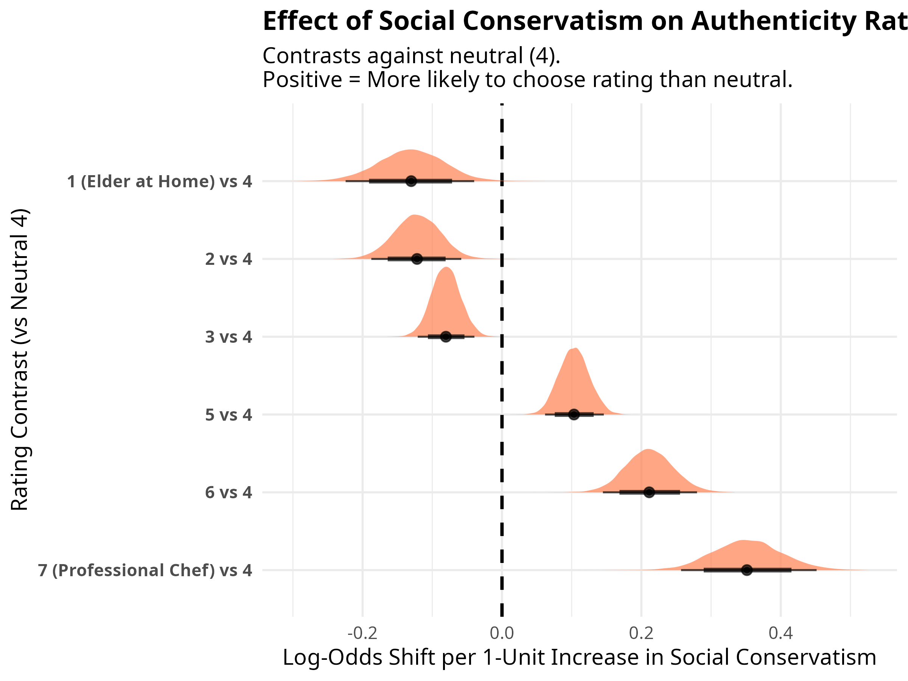
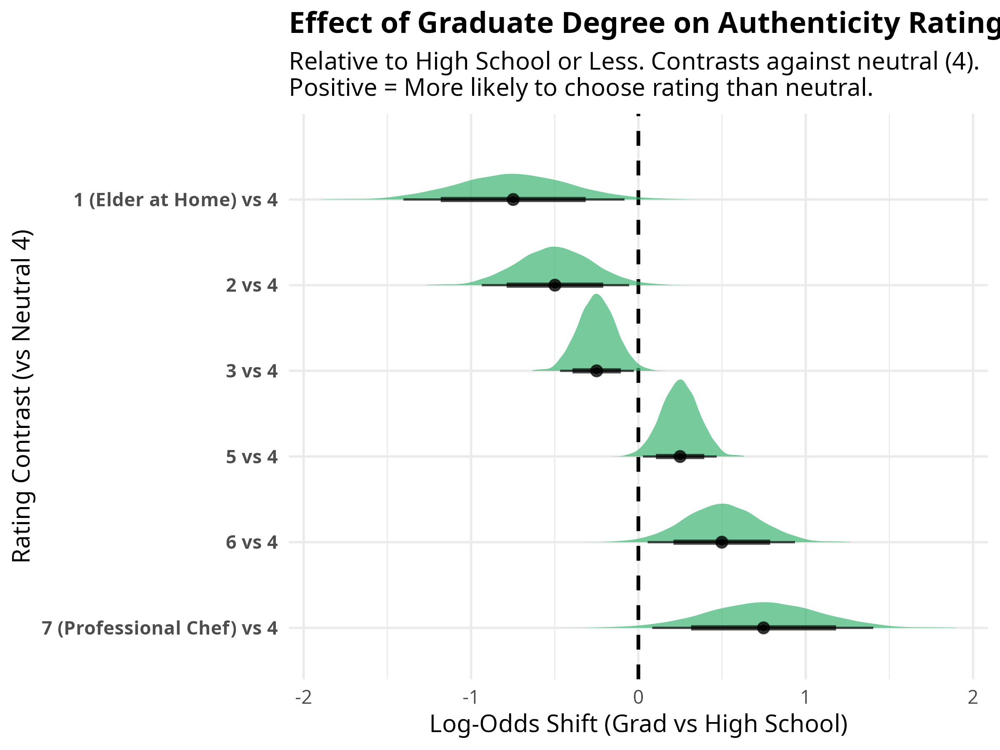
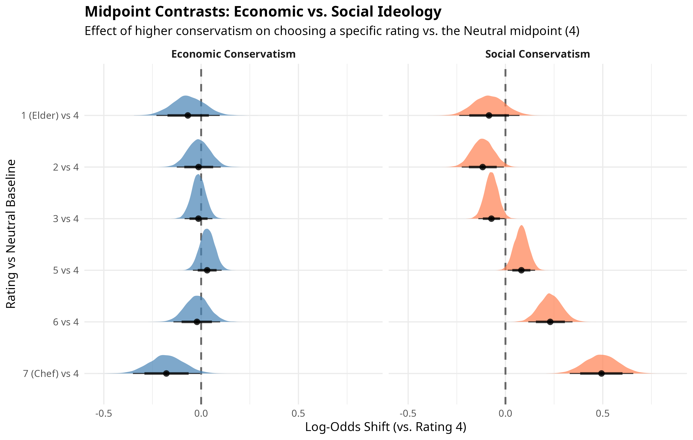
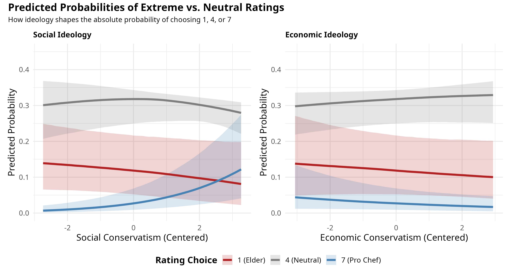
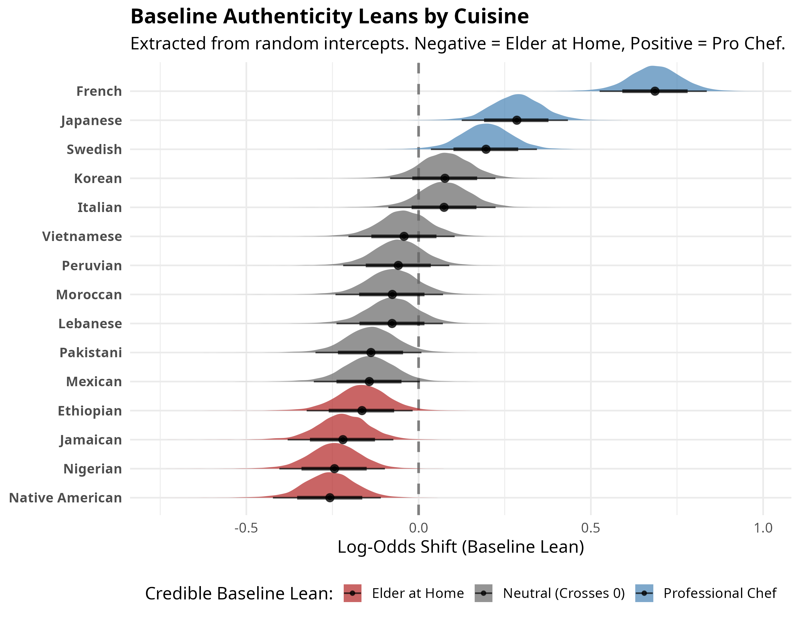
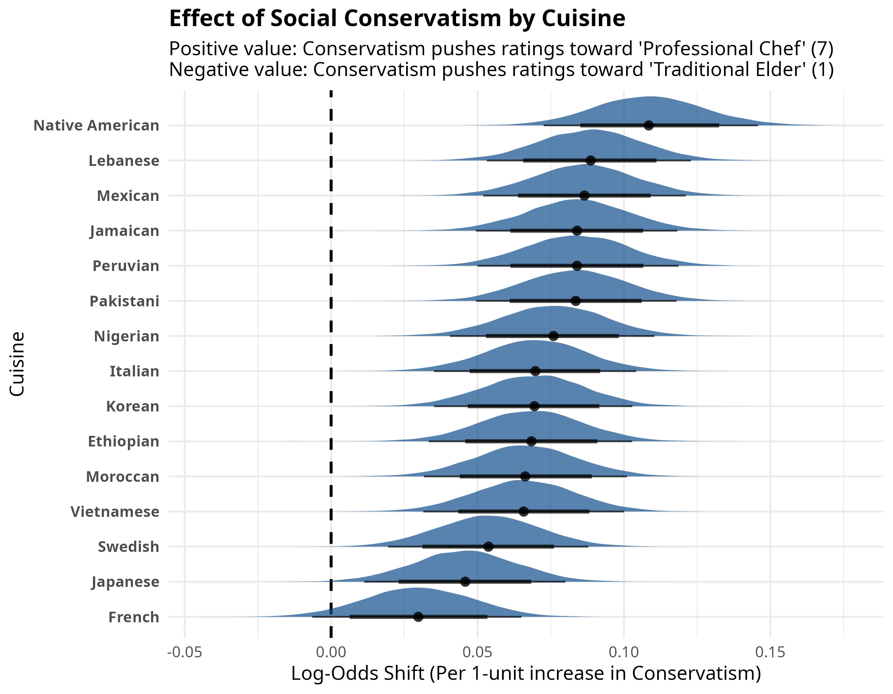
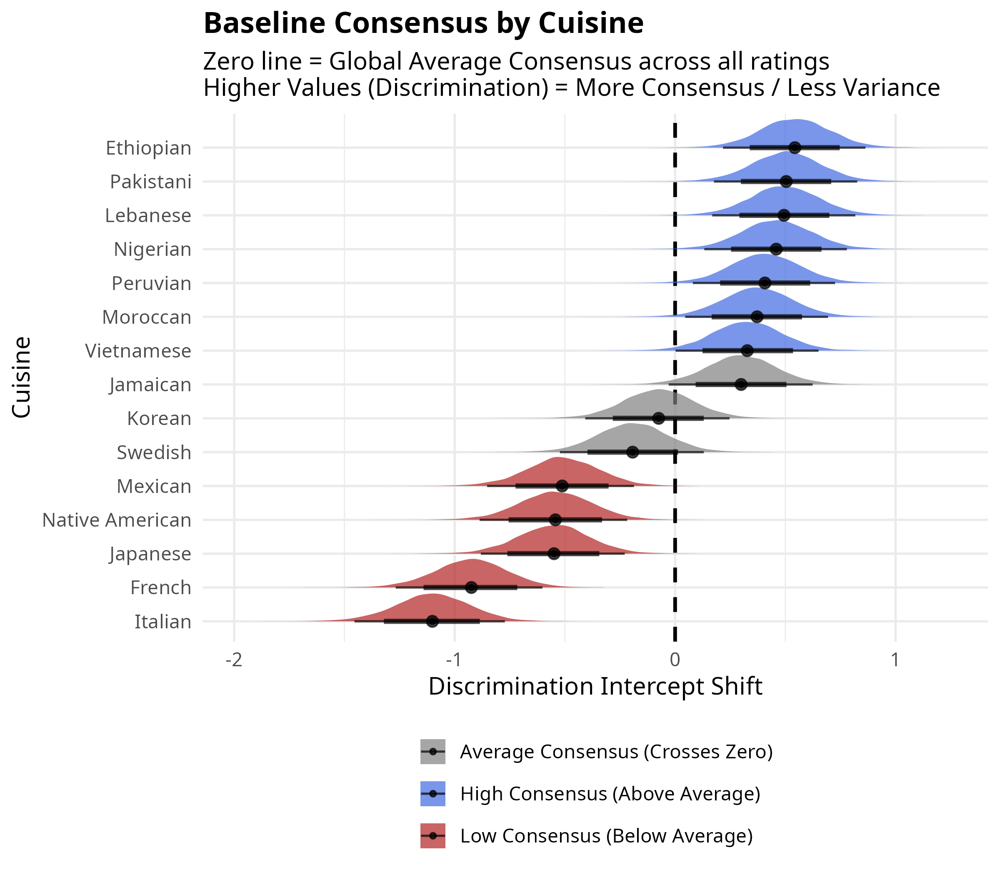
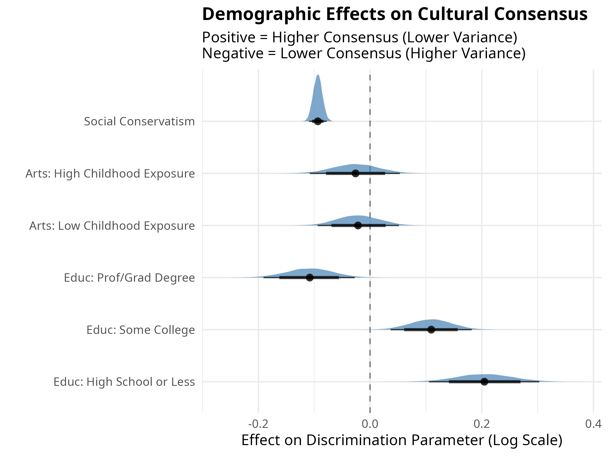
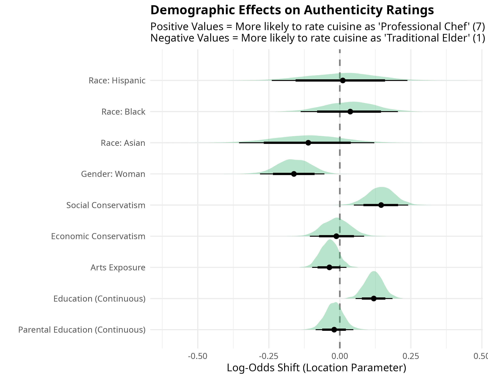

## 1. Introduction

This report outlines the full data analysis pipeline for analyzing how respondents perceive the authenticity and ideal preparation of various cuisines. The core dependent variable asks respondents to rate 15 different cuisines on a 1-to-7 ordinal scale mapping onto concepts of authenticity and professionalization:

*   **1** = A Traditional Recipe by an Elder at Home
*   **4** = Neutral / Midpoint
*   **7** = A Developed Recipe by a Professional Chef at a High-End Restaurant

The primary analytical goal is to evaluate how sociodemographic factors and ideological leanings (e.g., Social Conservatism) influence these perceptions across the rating scale.

---

## 2. Data Preparation and Reshaping

The data pipeline begins with raw survey data combining Qualtrics and Prolific samples. 

1.  **Recoding and Cleaning (`recode.dat.R`)**: 
    *   Demographic variables (age, education, income, gender, race) are cleaned and transformed into ordered/unordered factors (e.g., `educ.f`, `inc.f`) to act as fixed effects controls.
    *   Ideological indices are constructed. Crucially, continuous predictors like **Social Conservatism (`social`)** are mean-centered (`social_c`). Centering ensures that the model intercepts represent the "average" survey respondent, which aids in convergence and interpretation.
2.  **Long-Format Reshaping**: 
    *   To leverage multilevel modeling, the 15 separate cuisine rating columns are pivoted into a "long" dataset. Each row represents a single respondent's rating of a single cuisine. 
    *   This structure allows the model to treat both `respondent_id` and `cuisine` as grouping variables (random effects), controlling for individual response tendencies and baseline differences between cuisines.

---

## 3. Modeling Strategy: Bayesian Adjacent Category (ACAT) Models

Because the outcome is a 1-to-7 ordinal scale, standard linear regression is inappropriate (it assumes the conceptual "distance" between a 1 and 2 is identical to a 6 and 7). Instead, we utilize **Bayesian Multilevel Ordinal Models** via the `brms` package.

We selected the **Adjacent Category (ACAT)** family. Unlike cumulative ordinal models (which predict the probability of rating *at least* a category), ACAT models predict the probability of choosing category $k+1$ rather than category $k$. This aligns conceptually with how survey respondents make step-by-step decisions on a Likert scale.

### Strict vs. Category-Specific Effects
We fitted two competing model specifications:
*   **Model 1 (Strict)**: Assumes that predictors (like social conservatism) have the exact same proportional effect across all thresholds (e.g., the push from 1 to 2 is the same as the push from 6 to 7).
*   **Model 2 (Category-Specific)**: Relaxes this assumption using the `cs()` specification (e.g., `cs(social_c)`). This allows the slope of the predictor to vary across each step of the rating scale, capturing non-linear or polarizing effects at the extremes of the scale.

### Computational Safeguards
Due to the massive complexity of Category-Specific ACAT models, they require significant computational resources. During model fitting, we encountered Out-Of-Memory (OOM) crashes and convergence warnings. The pipeline was adjusted to:
*   Increase iterations to **6,000** (with 3,000 warmup) to ensure sufficient Bulk Effective Sample Size (ESS) for complex parameters.
*   Restrict sampling to **2 cores** to strictly manage RAM footprint.
*   Implement strategic file checkpointing (`saveRDS`) immediately after sampling to prevent data loss during heavy post-processing steps.

---

## 4. Model Comparison

To determine whether the complex Category-Specific model (Model 2) was justified over the simpler Strict model (Model 1), we compared their predictive performance. 

Because standard Leave-One-Out Cross-Validation (LOO) requires allocating likelihood matrices that exceed system RAM, we utilized the **Watanabe-Akaike Information Criterion (WAIC)** subsetted to 1,000 random posterior draws. 

**Results:**

::: {.cell}
::: {.cell-output-display}

Table: Comprehensive Model Comparison using WAIC (Ranked by Fit)

|Model                      |      ELPD| Δ ELPD (from best)|     WAIC| SE (WAIC)|
|:--------------------------|---------:|------------------:|--------:|---------:|
|Distributional Variance    | -26844.81|               0.00| 53689.62|    249.46|
|Econ/Soc Category-Specific | -27605.35|             760.53| 55210.69|    242.94|
|Category-Specific Baseline | -27619.02|             774.21| 55238.04|    242.19|
|Random Slopes (Ideology)   | -27633.32|             788.51| 55266.64|    242.81|
|Strict Baseline            | -27653.03|             808.22| 55306.06|    242.53|

:::
:::

*   **Conclusion**: 
    1. The **Distributional Variance model** provides a massively superior fit ($\Delta$ ELPD > 750) over all standard location models, indicating that modeling the *variance* (consensus) of authenticity ratings is just as crucial as predicting the average rating.
    2. Among standard location models, the **Category-Specific** models decisively beat the Strict Baseline, confirming that the effect of demographics on cuisine ratings is *not* uniform across the 1-to-7 scale.

### 4.1 Posterior Predictive Checks
To ensure the ordinal model accurately captures the shape of the data, we perform a posterior predictive check (PPC). This compares the model's predicted counts for each ordinal rating category against the actual observed distribution.

::: {.cell layout-align="center"}
::: {.cell-output-display}
{fig-align='center' width=80%}
:::
:::

*If the light blue intervals tightly capture the dark blue observed bars, particularly for the central neutral category ("4") and the extremes, the model is successfully recovering the response process.*

---

## 5. Preliminary Findings: The Effect of Social Conservatism

To interpret the category-specific effects, we extracted the posterior draws for each threshold step (1|2, 2|3, ..., 6|7) and mathematically recombined them into **contrasts against the neutral midpoint (4)**. This allows us to visualize how a 1-unit increase in Social Conservatism shifts the probability of choosing an extreme rating relative to staying neutral.

::: {.cell layout-align="center"}
::: {.cell-output-display}
{fig-align='center' width=100%}
:::
:::

**Key Takeaways from the Midpoint Contrasts:**
*   **Directionality**: A positive log-odds shift for a specific category indicates that higher conservatism *increases* the likelihood of choosing that rating (relative to a 4). A negative shift indicates a *decrease* in likelihood.
*   **Extremes**: By looking at the 95% Credible Intervals for the "1 (Elder at Home) vs 4" and "7 (Professional Chef) vs 4" contrasts, we can directly observe how ideology pushes respondents toward or away from specific definitions of culinary authenticity.
*   **Credible Shifts**: Thresholds where the error bars (95% CI) do not cross the zero-line are flagged as credible, meaning we have high Bayesian confidence in the ideological effect at that specific point on the scale.

### 5.1 The Effect of Education (Class Dynamics)

Concepts of "authenticity" and preference for "high-end chefs" versus "traditional elders" are heavily theorized as class-based (cultural capital). To investigate this, we computed similar midpoint contrasts comparing respondents with a **Graduate Degree** to those with **High School or Less** (relative to the baseline of a College Degree).

::: {.cell layout-align="center"}
::: {.cell-output-display}
{fig-align='center' width=100%}
:::
:::

This reveals whether highly educated respondents are drawn more toward the "traditional elder" for certain cuisines (a possible marker of omnivorous cultural capital) compared to less educated respondents, or if they lean toward professionalization.

### 5.2 Competing Ideologies: Social vs. Economic Conservatism

Often treated as a monolith, political ideology actually pulls cultural preferences in opposing directions depending on whether we measure social or economic conservatism. To disentangle this, we fit a category-specific model containing both predictors. 

Instead of showing step-by-step thresholds, the plot below maps how a 1-unit increase in conservatism changes the probability of choosing a specific extreme over the neutral midpoint (4). 

::: {.cell layout-align="center"}
::: {.cell-output-display}
{fig-align='center' width=100%}
:::
:::

**Key Ideological Divergence:**
*   **Social Conservatism Drives Polarization**: As social conservatism increases, respondents are wildly more likely to abandon the neutral midpoint for "7 - Professional Chef." They are simultaneously far less likely to choose "1 - Traditional Elder." They are decisively drawn to the high-end, professional definition of authenticity.
*   **Economic Conservatism Drives Centrism**: Conversely, economic conservatism exerts an anti-polarizing gravitational pull. High economic conservatives are *less* likely to choose the extreme "Professional Chef" and slightly less likely to choose the extreme "Elder." They pull inward toward the neutral baseline (4), avoiding extreme categorizations of cultural goods altogether.

To make these log-odds shifts more intuitive, we can translate them back into **Predicted Probabilities**. The ribbon plot below shows the absolute probability of a respondent choosing either of the two extremes (1 or 7) versus the exact midpoint (4) as their ideology shifts from liberal to conservative.

::: {.cell layout-align="center"}
::: {.cell-output-display}
{fig-align='center' width=100%}
:::
:::

*   **Social Ideology (Left Panel):** Look at the blue line (rating of 7 - Professional Chef). For highly liberal respondents, the probability of choosing 7 is near zero. As we move to the right (highly conservative), the probability sharply spikes upwards, while the red line (1 - Elder) is depressed. 
*   **Economic Ideology (Right Panel):** As we move to the right (more economically conservative), the probability of choosing *either* extreme (the red line and the blue line) slopes slowly downward. Instead, the gray line (rating of 4 - Neutral) swells in the middle, visually confirming that economic conservatism exerts a centrist pull, pulling respondents away from absolute categories.

## 6. Baseline Cuisine Leans and Ideological Slopes (Random Effects)

In addition to fixed effects like ideology, the model estimates a random intercept for each of the 15 cuisines. This shows us the baseline public consensus for where each cuisine "belongs" on the authenticity-to-professionalization spectrum, holding demographic and ideological differences constant.

::: {.cell layout-align="center"}
::: {.cell-output-display}
{fig-align='center' width=100%}
:::
:::

**Key Baseline Findings:**
*   **Most "Elder at Home"**: Native American, Nigerian, Jamaican, and Ethiopian cuisines have statistically credible negative intercepts, meaning the average respondent views them as most authentically prepared by a traditional elder at home.
*   **Most "Professional Chef"**: French, Japanese, and Swedish cuisines have strong positive intercepts, firmly rooting them in the high-end professional/chef domain in the public eye. (French cuisine is the most extreme outlier in this direction).

### 6.1 Do ideological effects vary by cuisine?

We estimated a random slopes model, allowing the effect of social conservatism to vary independently for each cuisine. WAIC comparisons indicated this provided a statistically significant improvement in model fit ($\Delta$ ELPD = -19.2), confirming that ideology interacts with specific cuisines differently.

The following plot combines the global fixed effect of social conservatism with the cuisine-specific deviations (random slopes) to show the total ideological push for each cuisine.

::: {.cell layout-align="center"}
::: {.cell-output-display}
{fig-align='center' width=100%}
:::
:::

A **negative slope** means that higher conservatism pulls that specific cuisine toward the "Traditional Elder at Home" (1) rating, while a **positive slope** pushes it toward the "Professional Chef" (7) rating.

---

## 7. Cultural Consensus and Variance (Distributional Model)

To answer the question of whether there is widespread public agreement (consensus) vs. contestation (high variance) on these authenticity ratings, we fit a **Distributional (Location-Scale) ACAT Model**. This model simultaneously predicts both the core rating choice (location) and the precision or consensus of the responses (the `disc` parameter, which is the inverse of variance).

### 7.1 Baseline Variance by Cuisine

By extracting the random intercepts for the `disc` parameter, we can determine which cuisines generate the most cultural consensus in the US.

::: {.cell layout-align="center"}
::: {.cell-output-display}
{fig-align='center' width=100%}
:::
:::

*   **High Consensus (Blue)**: Cuisines like Ethiopian, Pakistani, and Lebanese are highly agreed upon by the public (they have very low variance in ratings). They generally map uniformly to the "Traditional Elder" side of the scale without much contestation.
*   **Low Consensus (Red)**: Italian, French, and Japanese cuisines produce massive rating variance. Because these cuisines exist simultaneously as everyday domestic food and highly formalized, elite professional cuisine in the US, respondents exhibit fundamental disagreement about where their "authenticity" lies.

### 7.2 Demographic Effects on Cultural Consensus

Do certain demographic groups have stronger consensus than others? The following Bayesian "half-eye" forest plot visualizes the probability distribution of the demographic effects on the `disc` (consensus) parameter.

*   **Blue Shaded Area**: The Bayesian posterior density (where the true effect is most likely to be).
*   **Lines**: 80% and 95% Credible Intervals.

::: {.cell layout-align="center"}
::: {.cell-output-display}
{fig-align='center' width=100%}
:::
:::

**Key Insights into Consensus:**
*   **Education Drives Consensus:** Respondents with a High School education or less display significantly more consensus (lower variance) in their ratings. Conversely, those with Professional/Graduate degrees have the lowest consensus (widest variance). 
*   **Ideological Chaos:** As social conservatism increases, the discrimination parameter firmly drops. Conservatives exhibit significantly higher variance (less consensus) in their authenticity ratings compared to liberals.
*   **Arts Exposure:** Childhood exposure to the arts does not have a statistically credible effect on variance, as its distribution widely crosses zero.

---

## 8. Global Demographic Shifts (Strict Effects)

Using the foundational Strict model, we can map how core demographic characteristics shift overall ratings along the authenticity spectrum. 

In this plot:
*   **Negative Values** = Pushes ratings toward "1 - Traditional Elder at Home"
*   **Positive Values** = Pushes ratings toward "7 - Professional Chef"

::: {.cell layout-align="center"}
::: {.cell-output-display}
{fig-align='center' width=100%}
:::
:::

**Core Demographic Patterns:**
1.  **Gender**: Women are strongly more likely than men to view food authenticity as anchored in the "Traditional Elder at Home" (the entire posterior distribution is negative).
2.  **The Class/Education Divide**: Respondents with High School or Some College degrees lean toward "Traditional Elder," whereas holding a Professional/Graduate degree is the *only* educational bracket that reliably pushes ratings toward "Professional Chef."
3.  **Ideology**: Social conservatism exerts a tight, highly confident positive push, meaning conservatives are structurally more likely to associate authenticity with high-end, professional preparation than liberals.
4.  **Race**: Racial categorizations (Hispanic, Black, Asian), once controlling for class and ideology, largely hover over zero, indicating they are not the primary structural drivers of authenticity associations in this global sample.
