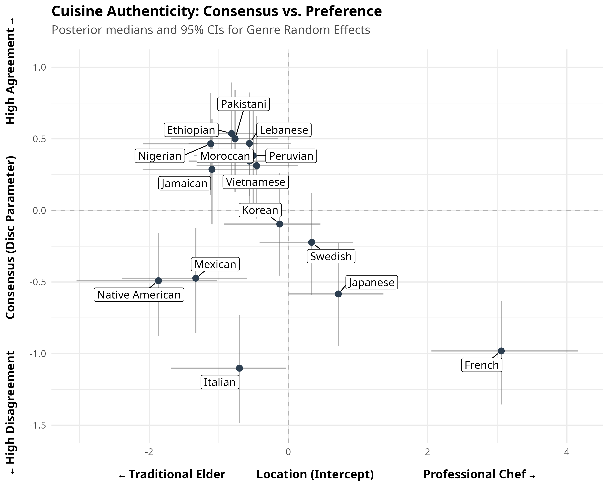

By plotting the **Location Intercept** (x-axis: overall liking, or "chef-ness" for cuisine) against the **Disc Parameter** (y-axis: level of consensus vs. polarization), we can identify fascinating patterns in how cultural tastes are structured across domains. 

Across all four domains, a recurring theme emerges: **niche or "safe" categories tend to generate high consensus (agreement), while categories tied to strong cultural identities, fandoms, or extreme aesthetics drive massive polarization.**

## 1. Cuisine Authenticity (Professional vs. Domestic)

*Unlike the other domains, Cuisine's x-axis measures whether a food is best prepared by a "Traditional Elder" (left) vs. a "Professional Chef" (right).*

* **The Polarized Extremes:** French cuisine (x = 3.06) is viewed as the most "Professional" cuisine by far, but it is deeply polarized (y = -0.98). Conversely, Italian (x = -0.70) and Mexican (x = -1.33) lean domestic/elder, but are the most highly polarized in the dataset (y = -1.10). This indicates fierce cultural disagreement about how these globally ubiquitous foods should be produced.
* **The High-Consensus Middle:** Cuisines like Ethiopian, Pakistani, and Lebanese sit near the middle of the x-axis but feature the highest consensus (y ≈ 0.50). Because they are less universally ubiquitous in the US context, respondents agree more uniformly on their production norms.

## 2. Music Taste (Like vs. Dislike)

* **The Identity Polarizers:** Rap (x = -1.66) and Heavy Metal (x = -3.07) are the most intensely polarizing genres in the entire project (y = -1.26 and -1.25, respectively). These are high-passion, identity-driven genres where listeners are strictly divided into "love it" or "hate it" camps.
* **The "Safe" Consensus:** Bluegrass, Folk, and Swing generate the highest consensus. They are mildly disliked on average, but almost everyone agrees on them—likely because they are non-offensive heritage genres that don't trigger intense aesthetic tribalism.
* **The Classic Rock Anomaly:** Classic Rock is uniquely fascinating; it is the most universally liked genre (x = +4.63) but is still highly polarized (y = -0.62). This implies a floor effect: almost nobody hates it, but the variance between "it's okay" and "it's the greatest music ever" is massive.

## 3. Television Taste

* **Broad Appeal = Consensus:** TV shows the clearest relationship between broad-market appeal and consensus. Mainstream genres like Action and Drama are both highly liked and enjoy high consensus.
* **The Fandom Effect:** The most polarized TV genres are Horror (y = -0.80), Sports (y = -0.67), and Sci-Fi (y = -0.54). Much like Rap and Metal in music, these genres rely on dedicated, fanatic audiences while actively alienating viewers outside the fandom.
* **Mundane Consensus:** Genres like Game Shows and Talk Shows are mildly disliked but boast very high consensus. They are the background noise of television, generating uniform, mild distaste rather than passionate hatred.

## 4. Movie Taste

* **The Polarized Auteur Genres:** Horror again proves to be deeply polarizing (y = -0.64), alongside Musicals (y = -0.26) and Romance. These genres require a specific aesthetic buy-in from the viewer that fractures audiences.
* **The Blockbuster Consensus:** Movie audiences agree strongly on Action, Drama, and Crime (y > 0.30), which also happen to be highly liked. These represent the standard narrative backbone of Hollywood, producing highly uniform, agreeable audience reactions.

## Summary

When looking at the plots side-by-side, **Music and Cuisine exhibit much deeper vertical variance (polarization) than TV and Movies.** People disagree far more vehemently about what music they identify with and how their food should be cooked than they do about what to watch on a screen. Screens drive consensus; food and music drive cultural tribalism.
