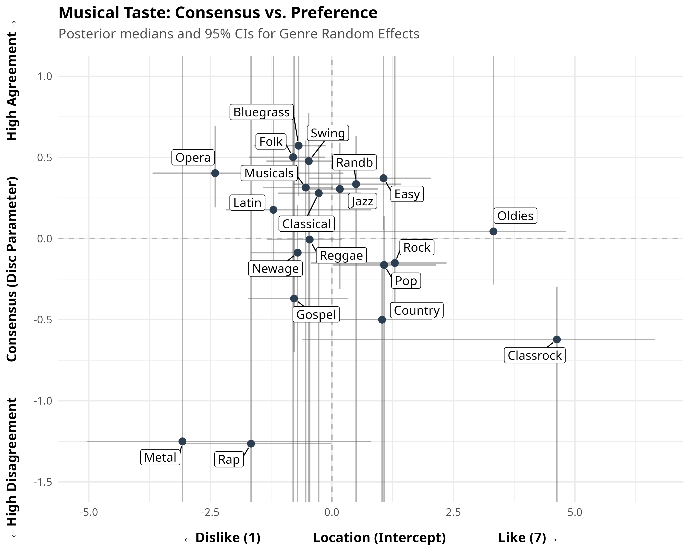
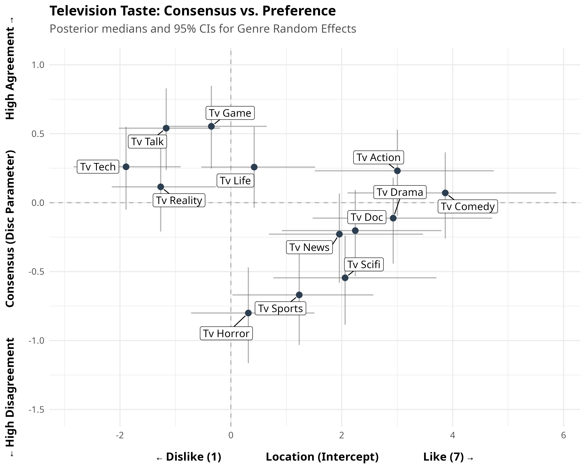
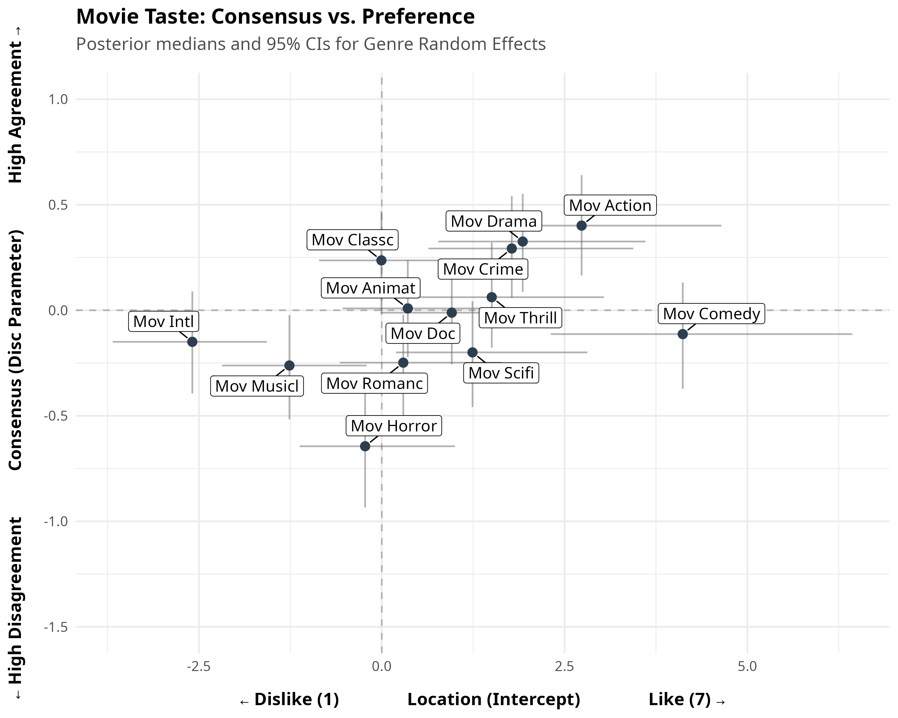

By plotting the **Location Intercept** (x-axis: overall liking from Dislike to Like) against the **Disc Parameter** (y-axis: level of consensus vs. polarization), we can identify clear patterns in how cultural tastes are structured across media domains. 

Across all domains (Music, Television, Movies), a recurring theme emerges: **mainstream, accessible categories generate high consensus (agreement), while categories tied to strong subcultural identities, fandoms, or extreme aesthetics drive polarization.**

## 1. Music Taste (Like vs. Dislike)

* **The Identity Polarizers:** Rap (x = -1.66) and Heavy Metal (x = -3.07) are the most intensely polarizing genres in the dataset (y = -1.26 and -1.25, respectively). These are high-passion, identity-driven genres where listeners are strictly divided into "love it" or "hate it" camps.
* **The "Safe" Consensus:** Bluegrass, Folk, and Swing generate high consensus. They are mildly disliked on average, but almost everyone agrees on them—likely because they are non-offensive heritage genres that don't trigger intense aesthetic tribalism.
* **The Classic Rock Anomaly:** Classic Rock is uniquely fascinating; it is the most universally liked genre (x = +4.63) but is still highly polarized (y = -0.62). This implies a floor effect: almost nobody hates it, but the variance between "it's okay" and "it's the greatest music ever" is massive.

## 2. Television Taste

* **Broad Appeal = Consensus:** TV shows the clearest relationship between broad-market appeal and consensus. Mainstream genres like Action and Drama are both highly liked and enjoy high consensus.
* **The Fandom Effect:** The most polarized TV genres are Horror (y = -0.80), Sports (y = -0.67), and Sci-Fi (y = -0.54). Much like Rap and Metal in music, these genres rely on dedicated, fanatic audiences while actively alienating viewers outside the fandom.
* **Mundane Consensus:** Genres like Game Shows and Talk Shows are mildly disliked but boast very high consensus. They represent background entertainment, generating uniform, mild distaste rather than passionate hatred.

## 3. Movie Taste

* **The Polarized Auteur Genres:** Horror again proves to be deeply polarizing (y = -0.64), alongside Musicals (y = -0.26) and Romance. These genres require a specific aesthetic buy-in from the viewer that fractures audiences.
* **The Blockbuster Consensus:** Movie audiences agree strongly on Action, Drama, and Crime (y > 0.30), which also happen to be highly liked. These represent the narrative backbone of mainstream cinema, producing highly uniform, agreeable audience reactions.

## Summary

Across media domains, **Music exhibits noticeably deeper vertical variance (polarization) than TV and Movies.** People disagree far more vehemently about what music they identify with than they do about screen media. Screen-based entertainment drives broader consensus, whereas musical preferences remain deeply entrenched in aesthetic and subcultural identity.
